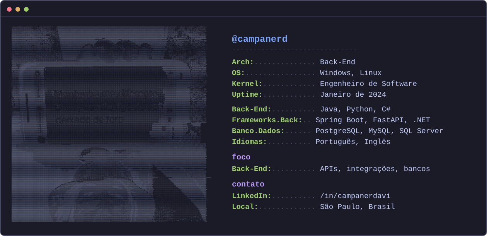

# Davi Campaner

**`Desenvolvedor Backend`**

Tenho 20 anos, moro em São Paulo e curso o quarto semestre de Análise e Desenvolvimento de Sistemas na FATEC-SP. Sou apaixonado por tecnologia e estou sempre em busca de soluções que façam sentido.

---

